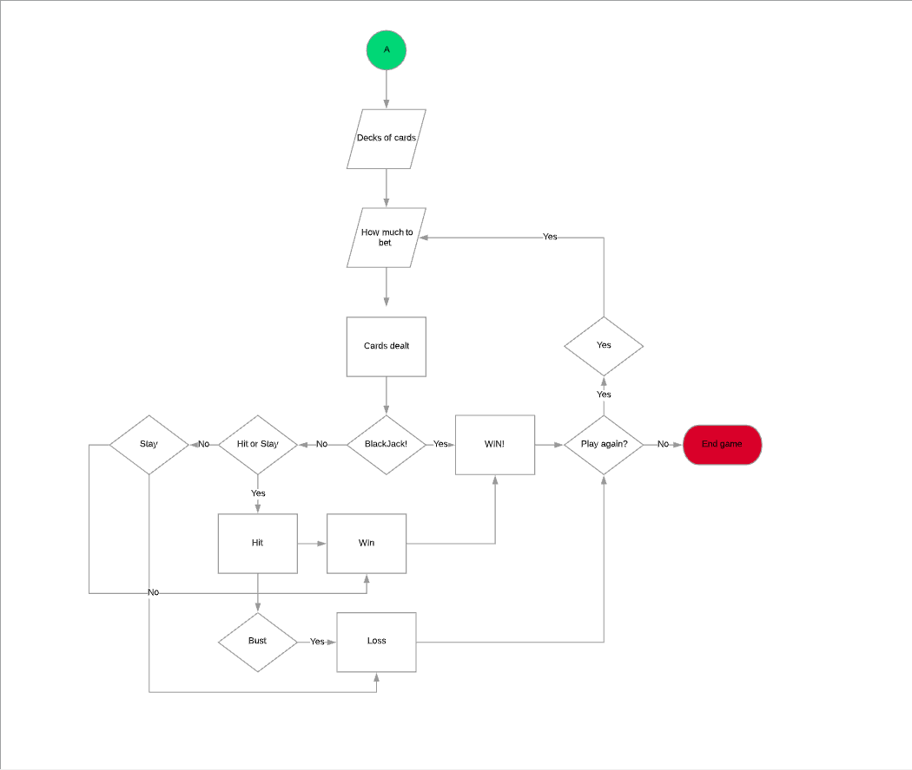

# Marcos-BlackJack

The aim of this project was to create a short terminal application using the fundamentals of the computer language, Ruby. In this project I created a simple yet straight forward, BlackJack type game drawing inspiration from the popular card game of the same name. 


## Description of the application

Marco's BlackJack is a simple, terminal app which attempts to replicate the famous casino card game into a text based version of the game. Unlike other games, card games like blackJack lack a general storyline. The application was written and run by the Ruby language.


## Identify the issue that it resolves

As of all games, I hope my game app succeeds in entertaining. 

# Software Development Plan

## Statement of Purpose and Scope

The main reason and purpose I made this game, was to test my Ruby language capabilities. Before I started this project, I was unsure if I was knowledgeable enough in Ruby, to create a working applications. This may not be a very complex application, but I am proud of what I have accomplished within the 2 weeks of Ruby learning.

## Target Audience

This Terminal application seeks to target people of all ages, since gamers come in all sorts of age groups, and blackjack is not neccearily just a "children's game". Moreover knowing that this application was written in Ruby, programmers who are interested in, but have not yet learnt Ruby could also be a targetted audience. Since Ruby as a language is a very flexible one and there are endless possibilities that can be created. I hope my application succeeds in showcasing what capabilities Ruby has.


## How will the Audience use it

Launch the ruby blackjack.rb file in terminal. You will require the colorize, artii and rubocop gems to run our app. Check the documentation in the following links for use and installation instructions.

## Features

1. First Screen
Once you run the application, the user should be quickly prompted and asked how many decks they wish to be playing with from 1-10. The higher the number, the higher the difficulty the blackjack games would be. This screen is only shown once and is not looped unless the application is restarted. If an invalid integer is received, the message "Please enter a valid integer" is displayed. And if a number outside the range of 1-10 is input, the phrase "The number of decks must be between 1 and 10." is prompted.

2. Bet?
The second option and feature to this terminal application is getting asked how much the user would like to bet, with a 1000 dollar starting cap. This screen is returned to again and again(looped) if the user wins and wants to continue. If the amount input is over the cap, a "sadly, you don't have enough funds to play this bet. Please enter a lower bet." is displayed on screen. Similar to the "You cannot place a zero or negative bet." error that is also displayed if a number =< 0.

3. To quit the game
At the end of each betting round or game, the user is asked if they would like to continue betting with a simple y/n. A simple "n" input by the user will automatically cause the terminal app to break. Ending the program. But if "y" is input, then the game should successfully loop back to the bet screen. 

## Project Management tools

Down below is the Trello board used while the application was still in progress. 


## Control Flow Diagram

This flowchart shows all the decisions and processes user will go through whilst running the Terminal application: 



# Help File

Make sure ruby is installed. This is the most important thing.

## Getting Started

To begin, make sure that the ruby gem is installed. we will need all the gems listed below:
1) rubocop
2) colorize
3) artii 

After all the gems are installed, install VSCode. VSCode will work for both MacOS and Windows. Also ensure all the files of the app are installed, as some require others to be in the same directory in order for it to work. 

### Prerequisites

To install the gems, you would first need a terminal. In MacOS this is already built in but if on Windows, you must find a terminal app to download. 

### Installing

1) Install VSCode by looking up the website and downloading it.
2) Install the gems by typing in gem install (name_of_gem) eg gem install pry will install pry. You should have these commands executed:
```
    gem install colorize
    gem install rubocop
    gem install artii
```

### Running the application

To run the app follow the steps below.

1. Make sure you have ruby installed on your machine.

2. Clone the repo.

```txt
git clone name.git
```
3. `cd` into the directory you've cloned

4. Run the build shell script

```txt
bash build.sh
```

5. Cd into the `dist` directory

6. Run the following command.

```txt
ruby app.rb
```

7. If you want to start the add in advanced mode

```txt
ruby app.rb -a
```


## Built With

* [VScode](https://code.visualstudio.com) - The web framework used
* [artii](https://github.com/miketierney/artii) - gem for ascii generator
* [colorize](https://github.com/fazibear/colorize) - gem for putting different colors on text
* [rubocop](https://github.com/rubocop-hq/rubocop) - gem for organizing code into a neat format 


## Authors

* **Marco Lo** - *Initial work* - [CayNex6](https://github.com/CayNex6)

